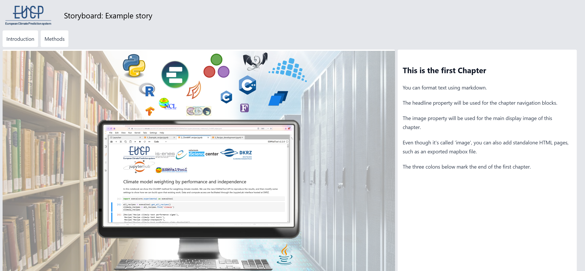

[](https://doi.org/10.5281/zenodo.5905676)
[](https://www.research-software.nl/software/storyboards)
[](https://sonarcloud.io/summary/new_code?id=eucp-project_storyboards)
[](https://fair-software.eu)

# Essentials for Software Support

On this repository, we are developing material for the course "Essentials for
Research Software Support".

The infrastructure is based on the
[storyboards](https://www.research-software.nl/software/storyboards) project.

The website has been built with [Nuxt](https://nuxtjs.org), using
[nuxt-content](https://content.nuxtjs.org/) for authoring stories and
[tailwindcss](https://tailwindcss.com/docs/installation) + [tailwind
typography](https://tailwindcss.com/docs/typography-plugin) for styling. It is
hosted on [GitHub pages](https://nuxtjs.org/deployments/github-pages/).

## Writing a story

All stories are stored in the `static/stories` folder. Each story consists of a
markdown file and a folder with some assets (images, etc.) belonging to the
story. In addition to standard markdown, the `:::Chapter{}` directive is used to
break the story into parts that can be displayed individually.

An example story might look like this:

`static/stories/example-story.md`
```markdown
---
title: Example story
author: Peter Kalverla et al., Netherlands eScience Center
thumbnail: "intro.png"
category: EUCP data and products
trl: high
id: 13
---
:::Chapter{headline="Introduction" image="intro.png"}
## This is the first Chapter
You can format text using markdown.

The headline property will be used for the chapter navigation blocks.

The image property will be used for the main display image of this chapter.

Even though it's called 'image', you can also add standalone HTML pages, such as
an exported mapbox file.

The three colons below mark the end of the first chapter.
:::

:::Chapter{headline="Methods" image="concept.png"}
## This is the second Chapter

and so on...
:::
```

This produces the following layout:



The images should be stored in a directory with the same name as the story, but
with a leading underscore, like so:

```bash
- static/
  - stories/
    - example-story.md
    - _example-story/
      - intro.png
      - concept.png
```

The frontmatter (title, author, etc.) will be used to show the story on the
stories overview page. The ID and TRL (technical readiness level) properties are
currently not used, but they are still here for legacy reasons.

## Adding your story to our collection

If you want your story to be included on
[eucp-project.github.io/storyboards](https://eucp-project.github.io/storyboards),
you can make a pull request to this repository. We will review it and if
everything is okay, we'll merge the story into the main branch. Continous
deployment will then automatically update the site.

If you want to add a story but are unsure about the github workflow, please
don't hesitate to get in touch. We are happy to help.

## Serving the site locally

You can also make a local build of the site, if you want to check that your
story is formatted correctly before making a pull request. The following
instructions are the default instructions from a new nuxt project. After cloning
the repository:

```bash
# install dependencies
$ npm install

# Enable legacy OpenSSL provider (needed for node.js > version 16.x)
$ export NODE_OPTIONS=--openssl-legacy-provider

# serve with hot reload at localhost:3000
$ npm run dev

# build for production and launch server
$ npm run build
$ npm run start

# generate static project
$ npm run generate
```

For detailed explanation on how things work, check out the [documentation](https://nuxtjs.org).

# Reusing the storyboards format for a different project

The source code (excluding the stories content) is licenced under Apache 2. You
can fork this repo and add your own content, modify the styling, and do whatever
you want. We'd appreciate it if you inform us about your re-using the software.
We're also happy to help setting it up for you.

# Reusing the storyboard materials
The content of the storyboards is licenced under CC-BY 4.0. Please don't
hesitate to contact the storyboard authors if you're interested in their work.
